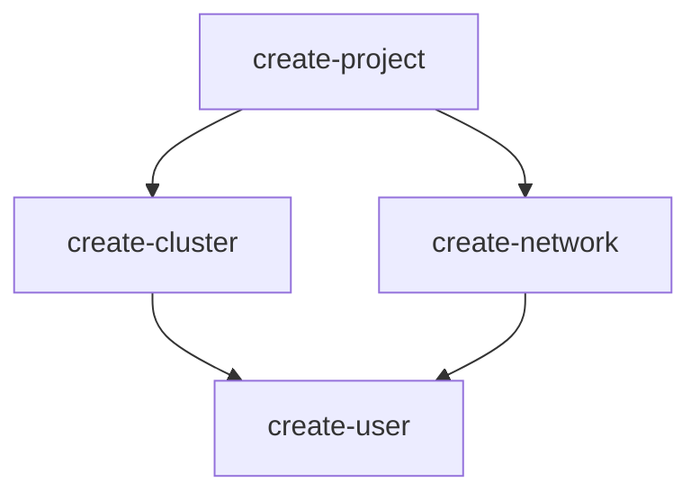

# DAG-Based Dependency Engine

Advanced dependency analysis and optimization for MongoDB Atlas infrastructure deployments.

{: .no_toc }

## Table of contents
{: .no_toc .text-delta }

1. TOC
{:toc}

---

## Overview

The DAG (Directed Acyclic Graph) engine provides intelligent dependency analysis, visualization, and optimization for infrastructure operations. It helps you understand the relationships between resources, identify bottlenecks, optimize execution order, and reduce deployment times.

### Key Capabilities

- **Dependency Analysis**: Automatically detect and analyze dependencies between Atlas resources
- **Critical Path Detection**: Identify operations that determine total execution time
- **Bottleneck Identification**: Find operations that block many others
- **Risk Assessment**: Evaluate risk levels and their impact on deployment success
- **Parallelization Opportunities**: Discover operations that can run concurrently
- **Visual Representation**: Generate graphs in multiple formats (ASCII, DOT, Mermaid, JSON)
- **Optimization Suggestions**: Get actionable recommendations to improve deployment efficiency

### Benefits

| Benefit | Description |
|:--------|:------------|
| **Faster Deployments** | Identify and optimize critical paths to reduce total execution time by 30%+ |
| **Risk Management** | Understand which operations are high-risk and on the critical path |
| **Better Planning** | Visualize dependencies before execution to avoid surprises |
| **Fail-Fast Strategy** | Place high-risk operations early to catch issues sooner |
| **Resource Efficiency** | Maximize parallelization to utilize available concurrency |
| **Debugging Aid** | Understand why certain operations must wait for others |

---

## Commands

The DAG engine provides three main commands:

### matlas infra analyze

Analyze dependency graph and identify issues.

```bash
# Basic analysis (text format)
matlas infra analyze -f config.yaml --project-id <project-id>

# Export as JSON
matlas infra analyze -f config.yaml --project-id <project-id> \
  --format json --output-file analysis.json

# Generate Markdown report
matlas infra analyze -f config.yaml --project-id <project-id> \
  --format markdown --output-file analysis.md

# Show detailed risk analysis
matlas infra analyze -f config.yaml --project-id <project-id> \
  --show-risk
```

**Output formats:**
- `text`: Human-readable text report (default)
- `markdown`: Markdown-formatted report for documentation
- `json`: Structured JSON data for programmatic use

**What it does:**
- Computes the critical path (longest sequence of dependent operations)
- Identifies bottleneck operations that block many others
- Performs risk analysis on all operations
- Calculates parallelization opportunities
- Generates optimization suggestions

**When to use:**
- Before deploying significant infrastructure changes
- To understand why deployments take a long time
- To identify high-risk operations on the critical path
- When planning resource scaling or major updates

---

### matlas infra visualize

Visualize the dependency graph in various formats.

```bash
# Terminal-friendly ASCII visualization (default)
matlas infra visualize -f config.yaml --project-id <project-id>

# Export as Graphviz DOT for rendering
matlas infra visualize -f config.yaml --project-id <project-id> \
  --format dot --output-file graph.dot

# Generate Mermaid diagram for documentation
matlas infra visualize -f config.yaml --project-id <project-id> \
  --format mermaid --output-file graph.mmd

# Export as JSON
matlas infra visualize -f config.yaml --project-id <project-id> \
  --format json --output-file graph.json

# Highlight critical path
matlas infra visualize -f config.yaml --project-id <project-id> \
  --highlight-critical-path

# Show dependency levels
matlas infra visualize -f config.yaml --project-id <project-id> \
  --show-levels --format ascii

# Compact mode
matlas infra visualize -f config.yaml --project-id <project-id> \
  --compact
```

**Output formats:**
- `ascii`: Terminal-friendly text visualization (default)
- `dot`: Graphviz format (render with `dot -Tpng graph.dot -o graph.png`)
- `mermaid`: Mermaid diagram format for Markdown/documentation
- `json`: Structured JSON data for programmatic use

**Available Options:**
- `--format`: Visualization format (ascii, dot, mermaid, json)
- `--highlight-critical-path`: Highlight operations on the critical path
- `--show-levels`: Display dependency level information
- `--show-durations`: Show estimated durations (enabled by default)
- `--show-risk`: Show risk levels (enabled by default)
- `--compact`: Use compact mode with less detail
- `--output-file`: Save visualization to a file

**When to use:**
- To understand resource dependencies visually
- To document deployment architecture
- To share dependency graphs with team members
- To debug complex infrastructure configurations

---

### matlas infra optimize

Get optimization suggestions to improve deployment efficiency.

```bash
matlas infra optimize -f config.yaml --project-id <project-id>
```

**What it does:**
- Analyzes current execution plan
- Identifies optimization opportunities
- Provides actionable recommendations
- Suggests improvements for speed, cost, or reliability

**When to use:**
- After analyzing a deployment plan
- To reduce deployment times
- To improve deployment reliability
- When planning infrastructure updates

---

## Understanding the Output

### Analyze Output

When you run `matlas infra analyze`, you'll see a comprehensive report with several sections:

#### 1. Overview Section

```
OVERVIEW
----------------------------------------------------------------------
Total Operations:      15
Dependencies:          8
Dependency Levels:     4
Has Cycles:            false
```

**What it means:**
- **Total Operations**: Number of infrastructure changes to be made
- **Dependencies**: How many dependency relationships exist between operations
- **Dependency Levels**: Maximum depth of dependency chain (affects minimum execution time)
- **Has Cycles**: Whether there are circular dependencies (should always be false)

**Key insights:**
- More dependency levels = longer minimum execution time
- Fewer dependencies = more parallelization opportunities
- Cycles indicate configuration errors (but are detected and prevented)

---

#### 2. Critical Path Section

```
CRITICAL PATH
----------------------------------------------------------------------
Length:   5 operations
Duration: 15m30s

Operations on Critical Path:
  1. create-project
  2. create-cluster-main
  3. create-database-user
  4. create-search-index
  5. verify-cluster-ready
```

**What it means:**
- The **critical path** is the longest chain of dependent operations
- These operations determine the **minimum possible execution time**
- Operations on the critical path cannot be parallelized with each other

**Key insights:**
- Focus optimization efforts on critical path operations
- Reducing duration of any critical path operation reduces total time
- Operations NOT on critical path have "slack" time (can be delayed)

**Example interpretation:**
> "Your deployment will take at least 15m30s because these 5 operations must run sequentially. Even with infinite parallelization, you cannot deploy faster than this."

---

#### 3. Bottlenecks Section

```
BOTTLENECKS
----------------------------------------------------------------------

1. create-cluster-main (main-cluster)
   Blocks:     8 operations (53.3% impact)
   Reason:     Bottleneck because: [on critical path blocks 8 operations]
   Mitigation: Consider reordering operations to reduce dependencies

2. create-project (MyProject)
   Blocks:     14 operations (93.3% impact)
   Reason:     Bottleneck because: [on critical path blocks 14 operations]
   Mitigation: Consider reordering operations to reduce dependencies
```

**What it means:**
- **Bottlenecks** are operations that many others depend on
- If a bottleneck fails or delays, it impacts many downstream operations
- **Blocks X operations**: How many operations must wait for this one
- **Impact percentage**: What fraction of total operations are affected

**Key insights:**
- High-impact bottlenecks (>50%) should be monitored carefully
- Consider adding validation steps before bottleneck operations
- Bottlenecks on critical path are especially important

**Example interpretation:**
> "The cluster creation blocks 8 other operations. If it fails or delays, more than half your deployment is affected. Make sure cluster creation succeeds before proceeding."

---

#### 4. Risk Analysis Section

```
RISK ANALYSIS
----------------------------------------------------------------------
Total Risk Score:      72.5
Average Risk Level:    high
High-Risk Operations:  5
Critical-Risk Ops:     2 (on critical path)

Risk Distribution:
  critical  : 2 operations
  high      : 3 operations
  medium    : 6 operations
  low       : 4 operations
```

**What it means:**
- **Risk Score**: Aggregate risk level (0-100, higher = more risky)
- **Average Risk Level**: Overall deployment risk category
- **Critical-Risk Ops**: High-risk operations on the critical path (worst case)

**Risk levels by operation type:**
- `critical`: Destructive operations (delete, drop) on critical path
- `high`: Delete/update operations, or operations on critical path
- `medium`: Update operations
- `low`: Create operations

**Key insights:**
- Critical-risk operations should be reviewed carefully
- High-risk operations on critical path increase deployment risk significantly
- Consider running with `--dry-run` first if risk score > 60

**Example interpretation:**
> "2 high-risk operations are on the critical path. If either fails, the entire deployment stops. Consider adding checkpoints or validation steps before these operations."

---

#### 5. Optimization Suggestions Section

```
OPTIMIZATION SUGGESTIONS
----------------------------------------------------------------------

1. Low parallelization factor (1.25). Consider reducing dependencies 
   to enable more parallel execution

2. Bottleneck detected: 'create-cluster-main' blocks 8 operations (53.3% of total)

3. 2 high-risk operations on critical path. Consider moving them earlier 
   (fail-fast) or adding validation steps

4. Critical path is 15m30s. Consider optimizing these operations:
   - create-cluster-main (10m)
   - verify-cluster-ready (3m)
```

**What it means:**
Each suggestion provides:
- **Problem identification**: What issue was detected
- **Impact assessment**: How it affects your deployment
- **Actionable recommendation**: What you can do to improve

**Common suggestions:**

| Suggestion | Meaning | Action |
|:-----------|:--------|:-------|
| Low parallelization factor | Too many sequential dependencies | Review if all dependencies are necessary |
| High-risk on critical path | Risky operations block everything | Move earlier (fail-fast) or add validation |
| Long critical path | Deployment takes too long | Optimize longest operations |
| High risk score | Many dangerous operations | Add checkpoints or use dry-run mode |
| Many bottlenecks | Few operations block many others | Consider reordering to reduce fan-out |

---

### Visualize Output

#### ASCII Format (Default)

```
Dependency Graph (ASCII)
============================================================

Level 0:
  [create-project (1m) [medium]]

Level 1:
  [create-cluster-main (10m) [high]]
  [create-network-access (10s) [low]]

Level 2:
  [create-database-user (30s) [medium]]
  [create-search-index (2m) [low]]

Level 3:
  [verify-cluster-ready (3m) [medium]]

Statistics:
  Total nodes: 5
  Total edges: 6
  Max level: 3
```

**How to read:**
- **Levels** represent dependency tiers (Level 0 has no dependencies)
- Operations in the same level can run in parallel
- **Duration** shows estimated execution time
- **Risk level** shown in brackets `[high]`, `[medium]`, `[low]`

**Example interpretation:**
> "Level 0 operations run first. Once complete, Level 1 operations (cluster and network access) can run in parallel. The max level of 3 means operations span 4 sequential stages."

---

#### DOT Format (Graphviz)

When you export to DOT format:

```bash
matlas infra visualize -f config.yaml --project-id <id> \
  --format dot --output-file graph.dot

# Render as PNG
dot -Tpng graph.dot -o graph.png

# Render as SVG
dot -Tsvg graph.dot -o graph.svg
```

**Visual elements in rendered graph:**
- **Nodes**: Rectangles represent operations
  - Color indicates risk level (red=high, yellow=medium, green=low)
  - Label shows operation name and duration
- **Edges**: Arrows show dependencies (A → B means "A depends on B")
  - Thick red edges highlight critical path
  - Dashed edges show soft dependencies
- **Clusters**: Grouped by resource type or level

**When to use:**
- Creating documentation with visual diagrams
- Presenting deployment architecture to stakeholders
- Debugging complex dependency chains
- Generating reports for compliance/audit

---

#### Mermaid Format

Mermaid format is ideal for Markdown documentation:

```bash
matlas infra visualize -f config.yaml --project-id <id> \
  --format mermaid --output-file graph.mmd
```

You can embed the output directly in Markdown:

````markdown

````

**Renders as:**
- Interactive diagram in GitHub, GitLab, Confluence
- Editable and version-controlled as text
- Automatically updates when configuration changes

---

### Optimize Output

```
Optimization Suggestions Report
======================================================================

Generated: 2025-12-09T11:30:00Z

HIGH SEVERITY
----------------------------------------------------------------------

1. Critical path is 15m30s (avg per operation: 3m6s)
   Type:   long_critical_path
   Impact: Total execution time dominated by critical path
   Action: Optimize operations on critical path or parallelize dependencies

2. 2 high-risk operations on critical path (40.0% of critical path)
   Impact: Deployment likely to fail if these operations fail
   Action: Move high-risk operations earlier (fail-fast) or add validation

MEDIUM SEVERITY
----------------------------------------------------------------------

1. Low parallelization factor (1.25)
   Impact: Limited concurrent execution
   Action: Review dependencies and enable more parallel operations

2. Bottleneck detected: 'create-cluster-main' blocks 8 operations (53% of total)
   Impact: Single point of failure affects majority of deployment
   Action: Add checkpoints or validation before this operation

LOW SEVERITY
----------------------------------------------------------------------

1. 3 operations have slack time > 5m
   Impact: These operations have significant buffer time
   Action: Consider reordering to optimize resource usage
```

**How to prioritize:**
1. **HIGH severity**: Address these first - they have the biggest impact on deployment time or reliability
2. **MEDIUM severity**: Improvements with moderate impact - good targets after high-priority issues
3. **LOW severity**: Nice-to-have optimizations - address if time permits

**Common optimization patterns:**

| Pattern | Problem | Solution |
|:--------|:--------|:---------|
| **Sequential Operations** | Everything runs one-at-a-time | Reduce unnecessary dependencies |
| **Long Critical Path** | Deployment takes too long | Optimize slowest operations |
| **High-Risk First** | Deployment fails late | Move risky operations earlier (fail-fast) |
| **Bottleneck Clusters** | One operation blocks many | Add validation or checkpoints |
| **Unbalanced Levels** | Some levels have many ops, others few | Rebalance dependency distribution |

---

## Complete Workflow Example

### Scenario: Deploying new infrastructure

```bash
# Step 1: Discover current state
matlas discover \
  --project-id abc123 \
  --convert-to-apply \
  --output yaml \
  -o current.yaml

# Step 2: Edit configuration (add new cluster, users, etc.)
vim infrastructure.yaml

# Step 3: Analyze dependencies
matlas infra analyze \
  -f infrastructure.yaml \
  --project-id abc123 \
  --show-risk

# Output shows:
# - Critical path: 12m30s
# - 3 bottlenecks identified
# - High risk score: 68.5
# - Recommendation: Review cluster creation on critical path

# Step 4: Visualize for team review
matlas infra visualize \
  -f infrastructure.yaml \
  --project-id abc123 \
  --format dot \
  --output-file deployment-graph.dot

# Render visualization
dot -Tpng deployment-graph.dot -o deployment-graph.png

# Step 5: Get optimization suggestions
matlas infra optimize \
  -f infrastructure.yaml \
  --project-id abc123

# Output suggests:
# - Move validation steps earlier
# - Reduce dependencies to improve parallelization
# - Consider staged deployment for high-risk operations

# Step 6: Review and adjust configuration based on analysis
# (e.g., reorder operations, add validation steps)

# Step 7: Preview changes
matlas infra diff -f infrastructure.yaml --detailed

# Step 8: Dry run with optimized configuration
matlas infra apply \
  -f infrastructure.yaml \
  --dry-run \
  --dry-run-mode thorough

# Step 9: Apply with confidence
matlas infra apply -f infrastructure.yaml --watch
```

---

## Advanced Usage

### Analyzing Specific Scenarios

#### Scenario 1: Major Cluster Update

```bash
# Before updating cluster configuration
matlas infra analyze -f cluster-update.yaml \
  --project-id abc123 \
  --show-risk

# Look for:
# - Cluster operations on critical path
# - Impact on dependent resources (users, indexes)
# - Estimated downtime from critical path duration
```

#### Scenario 2: Mass User Creation

```bash
# When creating many database users
matlas infra visualize -f users.yaml \
  --project-id abc123 \
  --show-levels

# Look for:
# - All users at same dependency level (parallel execution)
# - Any unexpected dependencies
# - Bottlenecks from cluster or network dependencies
```

#### Scenario 3: High-Risk Deletion

```bash
# Before deleting resources
matlas infra analyze -f cleanup.yaml \
  --project-id abc123 \
  --show-risk

# Look for:
# - Critical risk operations
# - What operations depend on resources being deleted
# - Risk score and distribution
```

---

### Integration with CI/CD

#### GitHub Actions Example

```yaml
name: Analyze Infrastructure Changes

on:
  pull_request:
    paths:
      - 'infrastructure/**'

jobs:
  analyze:
    runs-on: ubuntu-latest
    steps:
      - uses: actions/checkout@v3
      
      - name: Setup matlas
        run: |
          curl -L https://github.com/your-org/matlas-cli/releases/latest/download/matlas-linux-amd64 -o matlas
          chmod +x matlas
      
      - name: Analyze Changes
        run: |
          ./matlas infra analyze \
            -f infrastructure/config.yaml \
            --project-id ${{ secrets.ATLAS_PROJECT_ID }} \
            --output json > analysis.json
      
      - name: Check Risk Score
        run: |
          RISK_SCORE=$(jq '.riskAnalysis.totalRiskScore' analysis.json)
          if [ $(echo "$RISK_SCORE > 70" | bc) -eq 1 ]; then
            echo "::warning::High risk score detected: $RISK_SCORE"
          fi
      
      - name: Generate Visualization
        run: |
          ./matlas infra visualize \
            -f infrastructure/config.yaml \
            --project-id ${{ secrets.ATLAS_PROJECT_ID }} \
            --format mermaid \
            --output-file graph.mmd
      
      - name: Comment PR
        uses: actions/github-script@v6
        with:
          script: |
            const fs = require('fs');
            const graph = fs.readFileSync('graph.mmd', 'utf8');
            const analysis = fs.readFileSync('analysis.json', 'utf8');
            const data = JSON.parse(analysis);
            
            github.rest.issues.createComment({
              issue_number: context.issue.number,
              owner: context.repo.owner,
              repo: context.repo.repo,
              body: `## Infrastructure Analysis\n\n` +
                    `**Critical Path:** ${data.criticalPathDuration}\n` +
                    `**Risk Score:** ${data.riskAnalysis.totalRiskScore}\n` +
                    `**Bottlenecks:** ${data.bottlenecks.length}\n\n` +
                    `### Dependency Graph\n\`\`\`mermaid\n${graph}\n\`\`\``
            });
```

---

## Best Practices

### 1. Always Analyze Before Major Changes

```bash
# Good practice
matlas infra analyze -f config.yaml --project-id <id>
matlas infra apply -f config.yaml --dry-run
matlas infra apply -f config.yaml

# Poor practice
matlas infra apply -f config.yaml --auto-approve  # Skip analysis
```

### 2. Use Visualizations for Documentation

- Export DOT/Mermaid visualizations with each deployment
- Include in runbooks and incident response docs
- Update architecture diagrams from actual configurations

### 3. Monitor Critical Path Operations

- Set up alerts for operations on critical path
- Add extra logging/monitoring for bottleneck operations
- Consider checkpoints before high-impact bottlenecks

### 4. Act on Optimization Suggestions

- Review high-severity suggestions immediately
- Plan medium-severity improvements for next iteration
- Track low-severity items for continuous improvement

### 5. Use Risk Analysis for Staging Decisions

```bash
# High risk score? Stage the deployment
if [ risk_score > 70 ]; then
  # Deploy to dev first
  matlas infra apply -f config.yaml --project-id dev-project
  
  # If successful, promote to prod
  matlas infra apply -f config.yaml --project-id prod-project
fi
```

---

## Troubleshooting

### Issue: "Cannot compute critical path: graph contains cycle"

**Cause:** Circular dependencies in your configuration (A depends on B, B depends on A).

**Solution:**
```bash
# Use analyze with --show-cycles to identify the cycle
matlas infra analyze -f config.yaml --show-cycles

# Review and break the circular dependency
```

### Issue: "Low parallelization factor"

**Cause:** Too many sequential dependencies prevent parallel execution.

**Solution:**
- Review dependencies in configuration
- Remove unnecessary ordering constraints
- Consider if operations truly need to be sequential

### Issue: "High risk score but unsure why"

**Cause:** Many destructive operations or risky updates.

**Solution:**
```bash
# Get detailed risk breakdown
matlas infra analyze -f config.yaml --show-risk

# Review operations marked as high/critical risk
# Consider adding validation steps or checkpoints
```

### Issue: Visualization is too complex to read

**Cause:** Large configuration with many resources.

**Solution:**
```bash
# Use compact mode
matlas infra visualize -f config.yaml --compact

# Or filter to specific resource types when planning
# (create separate configs for different resource types)
```

---

## Performance Considerations

The DAG engine adds minimal overhead to plan generation:

| Configuration Size | Analysis Time | Memory Usage |
|:-------------------|:--------------|:-------------|
| 1-10 operations | < 100ms | < 10MB |
| 10-50 operations | < 500ms | < 50MB |
| 50-200 operations | < 2s | < 100MB |
| 200-1000 operations | < 10s | < 500MB |

For very large configurations (1000+ operations):
- Consider splitting into multiple configuration files
- Use resource filtering during discovery
- Analyze subsets of infrastructure separately

---

## Further Reading

- [Infrastructure Workflows](/infra/) - General infrastructure management
- [Discovery Documentation](/discovery/) - Enumerating Atlas resources
- [YAML Kinds Reference](/yaml-kinds-reference/) - Configuration format details
